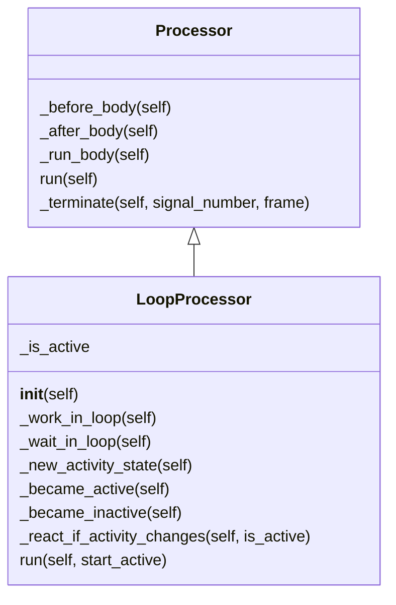
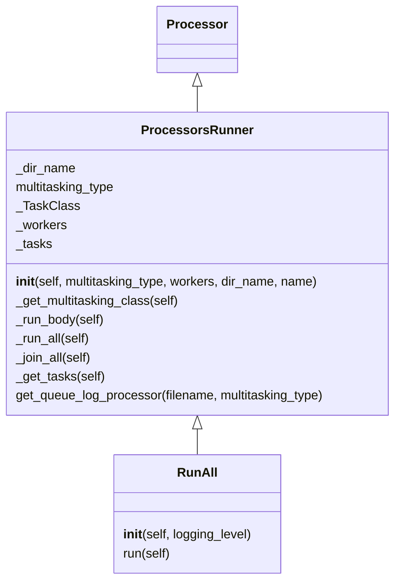

# Concurrent Harmony:

**Where Threads and Processes Sing Together.**

Concurrency Signal and State Management Library


## Motivation

I developed this library as part of a larger project at the company
<a href="zuri.com">Zuri.com. 

</a>

With the kind permission of <a href="https://illich.cz/">Michal Illich</a>,
I am publishing it here and offering it for public use.

The project involved collecting data from various sensors on a drone.
This data was logged on a local disk (flash card) and also transmitted via radio to the ground. Some data was read
directly (e.g., rangefinder, GPS from sensors), while other data was obtained from the flight control computer via the
CAN bus.

All of this required a **high degree of parallelism**.

The entire program ran on a Raspberry Pi 4b aboard the drone in a Raspberry Pi OS (Linux) environment.

## Overview

This Python library provides a **comprehensive framework** for managing concurrency in applications that involve **multiple
processes and threads**. It is designed to handle complex scenarios where processes and threads need to communicate and
coordinate their activities using signals and shared states. The library supports both standard signals and user-defined
signals, allowing for a flexible and powerful concurrency management solution.


## Installation
To install the library, clone the repository and install the required dependencies using pip:

```bash
git clone <repository-url>
cd <repository-directory>
pip install -r requirements.txt
```

## Getting Started
1. Review the examples provided in the examples/ directory to understand how to use the library in different scenarios.
2. Customize the provided classes to suit your specific needs. The library is designed to be flexible and extendable.
3. Run the example scripts to see how the library manages processes, signals, and states.

## License
This project is licensed under the MIT License. 


### Key Features

- **Concurrency Support**: The library supports both multi-threading and multi-processing, making it suitable for a wide
  range of use cases.
- **Signal Management**: The library allows processes and threads to communicate using both standard signals (
  e.g., `SIGTERM`, `SIGUSR1`) and user-defined signals. This makes it easy to manage complex process interactions.
- **State Management**: Processes can share and monitor their states using files. This is useful for tracking the
  activity of different processes in a distributed system.
- **GUI Integration**: The library includes tools for creating simple GUI interfaces that can send signals to control
  the behavior of processes and display their current states.

### Components

#### Core Classes

- **`Processor`**: The base class representing a unit of work that can be run in a process or thread. It provides
  methods for handling signals and managing state.
- **`LoopProcessor`**: A subclass of `Processor` designed for tasks that run in a loop, with methods to manage active
  and inactive states.
- **`ProcessorsRunner`**: A manager class that runs multiple `Processor` instances, either in separate threads or
  processes.
- **`StateInFile`**: A utility class for managing process states using files, enabling state persistence and
  inter-process communication.

#### Signal Management

- **`SignalsEnum`**: An enumeration that defines standard signals for activating, deactivating, and terminating
  processes.
- **`SignalContext`**: A class for managing user-defined signals, providing a context for sending and receiving signals.
- **`UserSignalConsumerProcessor`**: A processor that reacts to user-defined signals by changing its behavior based on
  the received signal.
- **`UserSignalProducer`**: A class for sending user-defined signals to other processes.

#### GUI Components

- **`Gui`**: A class for creating a simple Tkinter-based GUI that can send signals to control processes and display
  their current states.
- **`GuiProcessor`**: A helper class for managing the state of individual processes within the GUI.


## Explanation of the Library's Concepts

### Abstraction of a Piece of the Program and a Special Case - Loop

For example, data from the rangefinder is read in one loop in one thread, while data from the GPS is read in another
loop in another thread. The data from both of these threads is sent through a queue to a loop (thread/process) that
stores the data in files.

Below is a brief description of the concept.

The abstract description of some part of the program (which may not necessarily be a loop) is the class **Processor**.
It has a single 'public' method, **run**, meaning that other parts of the program can only "run" an instance of its
subclasses.

```python
def run(self):
    try:
        self._init_logging()
        self._before_body()
        self._run_body()
    finally:
        self._after_body()
        if not self.global_namespace.stop_all:
            self._stop_all_processes()
```

As you can see, subclasses of this class can override the methods _before_body, **_run_body**,
and _**after_body** to implement their behavior within a unified concept.

The subclass of **Processor** is **LoopProcessor**, which defines a general loop. Its run method looks like this:

```python
def run(self, start_active: bool = True):
    try:
        self.logger().info(f'+ START ({self.__class__.__name__}, PID={os.getpid()})')
        self._init_logging()
        self._before_body()
        self._is_active = False
        if start_active:
            self._react_if_activity_changes(True)  # start in active state
        while not self._is_stopped():
            is_active = self._new_activity_state()
            self._react_if_activity_changes(is_active)
            if self._is_active:
                try:
                    self._work_in_loop()
                except Exception as e:
                    self.logger().error(f'Loop error: {e}, (PID={os.getpid()}, {self.__class__.__name__})')
                    self.logger().exception(e)
            else:
                self._wait_in_loop()
    except Exception as e:
        self.logger().error(f'Run error: {e}, (PID={os.getpid()}, {self.__class__.__name__})')
        self.logger().exception(e)
    finally:
        try:
            self._stop_all_processes()
        except Exception:
            self.logger().info('Error in _stop_all_processes()', exc_info=True)
        self._after_body()
        self.logger().info(f'- STOP ({self.__class__.__name__}, PID={os.getpid()})')
        sleep(0.5)
```

In addition to more extensive logging, there are two main methods for subclasses to override:
**_work_in_loop** and **_wait_in_loop**.
These define behavior within the loop, either in the active or inactive state.



### Running in Threads and Processes

Running in threads and processes is handled by the **ProcessorsRunner** class, which has a **_run_all** method.

We distinguish between two types of multitasking: in threads and in processes:

```python
class ConcurrencyType(Enum):
    PROCESSES = auto()
    THREADS = auto()
```

The **ProcessorsRunner** class takes the type of parallelization (`multitasking_type`) and a list of processors (
workers - classes derived from **Processor**) as constructor parameters. This class itself is also derived from *
*Processor**, and in its `run` method, the **_run_all** method is called. This, in turn, runs all processors with the
specified type of parallelization.

Because **ProcessorsRunner** is derived from **Processor**, it can be nested within another **ProcessorsRunner**,
creating a hierarchy of processors and threads.

```python
class ProcessorsRunner(Processor):
    """
    Run Processors (workers). Each in its self process/thread.
    It is Worker also. Can be nested.
    """

    def __init__(
            self,
            multitasking_type: ConcurrencyType,
            workers: [Processor],
            ....
    ): ...
```



When creating an application (in our case, for running on an RPI or on a laptop for the ground station), a subclass of *
*ProcessorsRunner** (usually named **RunAll**) is created. In the constructor of its single instance (which represents
the entire application run), everything necessary is defined—individual processes and threads, their connections,
components needed for their operation, specific parameters (ports, speeds, etc.), and so on. This implements the
**Dependency Injection** design pattern.

```python
class RunAll(ProcessorsRunner):
    """
    Nakonfigurovaný singleton pro vybrané spouštění v procesech a vláknech
    """

``` 

### Logging

To enable logging in both simple configurations (a single process, a single thread)
and complex configurations (multiple processes and/or threads) using a unified interface,
many classes (including **Processor**) are subclasses of **LoggerAccess**.
(It is important to note that components do not know in which configuration they will be executed.)
The **LoggerAccess** class implements a single method (of the class) called **logger**.

```python
import logging


class LoggerAccess:

    @classmethod
    def logger(cls) -> logging.Logger:
        ...
``` 

In all classes derived from **LoggerAccess** (including those using multiple inheritance),
logging can be done, for example, as follows:

```python
self.logger().info(f'NMEAMessage: {parsed_message}')
self.logger().exception(f'Parse Error: {e}\n')
self.logger().error(f'Warning: empty GPS message\t')
```

For **more complex configurations** (multiple processes and/or threads), the following subclass is used:

```python
 class LogManager(LoggerAccess):
    ....
```

Messages are then sent to a queue:

```python
 class LogQueueStreamProcessor(LoopProcessor)
```

This is again a loop (_LoopProcessor_) running in a separate process/thread that picks
up messages from the queue and logs them (usually to a file).

(See example `examples/change_waiting_stop_example.py`)

### State Management and Sharing Variables Between Processes and Threads

Previously, I used `multiprocessing.Manager.Namespace`, but it can be time-consuming. (I mention this because there may
still be references to it in the code.)

Now, I primarily use:

- `multiprocessing.Event` for sharing state, such as (stop_all, is_waiting, is_active, ...).
  (See the example `src/examples/change_waiting_stop_example.py`)

- `multiprocessing.Value` or `multiprocessing.Array` for sharing auxiliary values, such as counters (e.g., message
  counts).

Let's discuss two of these events and their usage in more detail.

#### stop_event

The constructor of the **Processor** class (and all its subclasses) accepts an optional parameter **stop_event**.

```python
class Processor(LoggerAccess):
    def __init__(self, name: str = None, stop_event: Event = None):
        ...

    def set_stop_event(self, stop_event: Event) -> bool:
        ...
```

If **stop_event** is defined, it serves to propagate the information
throughout the entire hierarchy of processes and threads that everything
needs to be terminated. The stop request can be triggered by any instance
of the Processor class (and its subclasses) that shares this event. If
**stop_event** is not defined, a local variable is used instead, and the
termination applies only to this instance (it does not affect other
processes and threads). This 'fallback' is intended for cases where we
have a simple application running in a single process/thread.

The **set_stop_event** method is used to set the **stop_event**. This is
done only if the **stop_event** parameter was not defined in the
constructor (stop_event == None). Thus, outside the constructor,
**stop_event** can only be set if it was not previously set.

The mechanism that allows for the creation of hierarchical structures
of threads and processes is implemented in the **ProcessorsRunner** class.

```python
class ProcessorsRunner(Processor):
    def __init__(
            self,
            multitasking_type: ConcurrencyType,
            workers: [Processor],
            ...
    ):
        super(ProcessorsRunner, self).__init__(name=name, stop_event=stop_event, *args, **kwargs)
        ...

    self.set_events_to_processors()
```

As we can see in the usage example with two simple subprocesses and one subprocess with two threads:

```python
class ExampleRunner(ProcessorsRunner):

    def __init__(self, name: str, ....):
        ...

        is_waiting_event_for_last_process = multiprocessing.Event()

    super().__init__(
        multitasking_type=ConcurrencyType.PROCESSES,
        workers=[
            # proces pro logováním
            logger_processor,
            # omezení časem - vlastní process
            FakeProcessorMaxTime(max_seconds=max_seconds),
            # subproces s dvěma vlákny
            ProcessorsRunner(
                multitasking_type=ConcurrencyType.THREADS,
                workers=[
                    FakeProcessorChangeStateLoop(is_waiting_event=is_waiting_event_for_last_process),
                    FakeProcessorShowStateLoop(is_waiting_event=is_waiting_event_for_last_process)
                ],
                name='switch_activities',
                stop_event=stop_event,
            ),
        ],
        name=name,
        *args,
        **kwargs
    )
```

**ProcessorsRunner** calls its **set_events_to_processors** method
in its constructor, which hierarchically sets the **stop_event**
(and also **waiting_event** - see below) for all subclasses of
**Processor**, if it has not already been set in their constructor.
In this way, a single event propagates through all processes and threads
(see [examples./change_waiting_stop_example.py](examples./change_waiting_stop_example.py)).

|                                                                                                                                                       |
|:-----------------------------------------------------------------------------------------------------------------------------------------------------:|
| **This implies an important requirement for defining subclasses of _Processor_** (including subclasses of **LoopProcessor** and **ProcessorRunner**). |

All subclasses of **Processor** must either:

- Explicitly use the **stop_event** parameter in the constructor and
  call the parent constructor with this parameter.

```python
class FakeProcessorShowStateLoop(Processor):
    def __init__(self, sleep_s: int = 0.1, stop_event: multiprocessing.Event = multiprocessing.Event()):
        super().__init__(name='ShowState', stop_event=stop_event)
        ...

```

- Or (which is more general and less prone to errors) share all unspecified arguments of the constructor:

```python
class FakeProcessorShowStateLoop(Processor):
    def __init__(self, sleep_s: int = 0.1, *args, **kwargs):
        super().__init__(name='ShowState', *args, **kwargs)
        ...
```

|                                                                                                                                                                                                                        |
|:----------------------------------------------------------------------------------------------------------------------------------------------------------------------------------------------------------------------:|
| Another important requirement is that the **ProcessorRunner**, which is at the top level of the hierarchy (threads and processes), **should define** **stop_event=multiprocessing.Event()** (as seen in the examples). |

This event is then shared by all subprocesses/subthreads, and any of them can stop all the others.

#### waiting_event

This event toggles the state of a **LoopProcessor** between active and inactive. In the active state, the **self.
_work_in_loop()** method is repeatedly executed, and in the inactive state, the **self._wait_in_loop()** method is
executed.

```python	
class LoopProcessor(Processor):
    def __init__(
        self,
        name:str = None,
        stop_event: multiprocessing.Event = None,
        is_waiting_event: multiprocessing.Event = None,
		...
    ): ...
    
    def run(self, start_active: bool = True):
    	...
        while not self._is_stopped():
			is_active = self._new_activity_state()
			self._react_if_activity_changes(is_active)
			if self._is_active:
				try:
					self._work_in_loop()
				except Exception as e:
					self.logger().error(f'Loop error: {e}, (PID={os.getpid()}, {self.__class__.__name__})')
					self.logger().exception(e)
			else:
				self._wait_in_loop()
```

In the aforementioned example
([src/examples/change_waiting_stop_example.py](src/examples/change_waiting_stop_example.py)),
the **is_waiting_event** is not shared across the entire hierarchy of
processes and threads, but is instead created within the constructor
of **ExampleRunner(ProcessorsRunner)** and is used to control only two
threads. The corresponding processors receive this event as a
constructor parameter.

Both options (hierarchical propagation of the event to all, or explicit
definition for selected ones) are possible.

### Signals 
#### Process Control with Signals

It is important to note that signals are always received by the process
at the highest level (not directly by its subprocesses and threads).

A subclass of `src.concurrency.processors.Processor` can override the
**`register_signals()`** method to define reactions to specific signals.
(See the example
[`src/examples/signals_gui.py`](src/examples/signals_gui.py)).

#### User-Defined Signals

Since the repertoire of system signals is limited, you can find an
implementation for an arbitrary number of user-defined signals in
[src/signals/multiproc_user_signals.py](src/signals/multiproc_user_signals.py).

It works by sharing the signal context (here, just its ID) through a
file with a known name. Only a single selected signal (we use
`signal.SIGUSR1`) is sent between processes, and the details are
retrieved from the context. This method is suitable for applications
where signals are not sent frequently in quick succession. (This is the
case in our application, where signals are used only to change the
activity state of processes via command line commands [see below].)

A simple usage example can be found directly in
[src/signals/multiproc_user_signals.py](src/signals/multiproc_user_signals.py)
(after `if __name__ == '__main__': ...`). A more complex example with a
GUI can be found in
[src/examples/user_signals_gui.py](src/examples/user_signals_gui.py).

### Usage Examples

The previously mentioned examples in
[src/examples](src/examples) generate `.log.txt`
files in their folder when run. When studying these examples, it is
important to also look at these log files. Some examples also use files
with the `.state` extension in the same location to pass state
(active/passive) between controlled processes/threads and the GUI.
(These files are created at runtime and are not included in the git
repository.)


